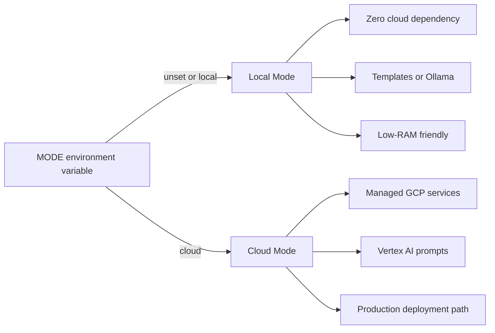
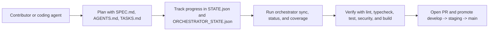
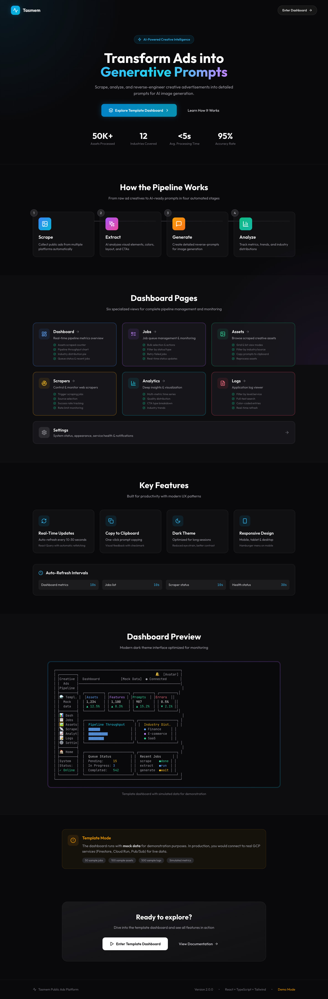
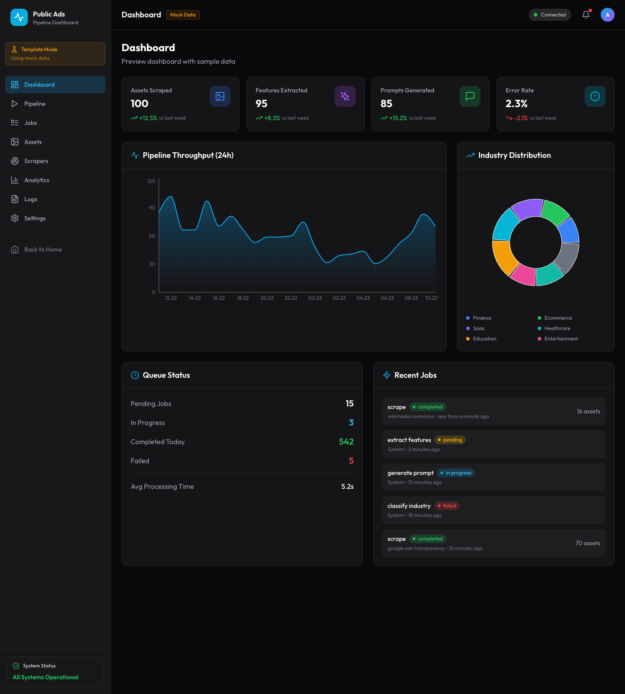
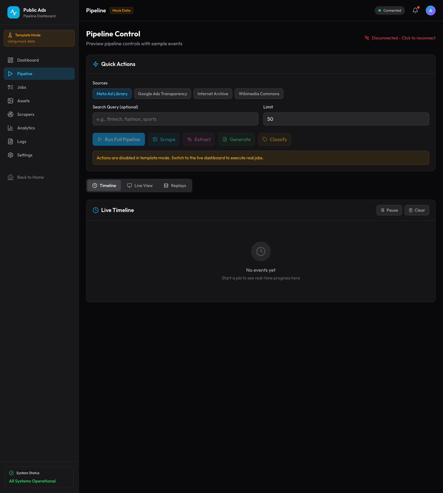
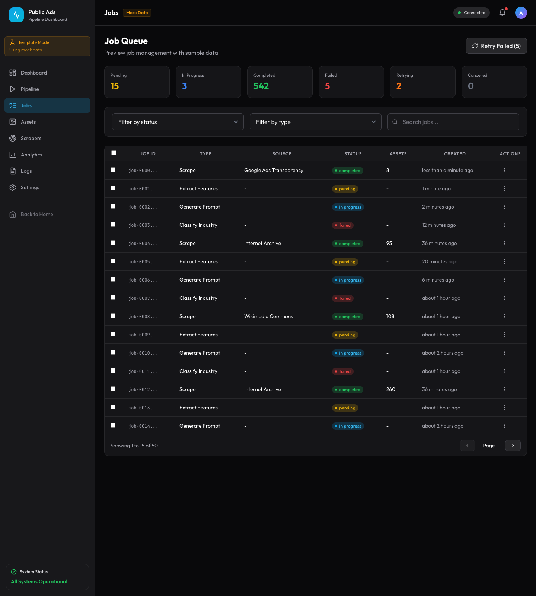
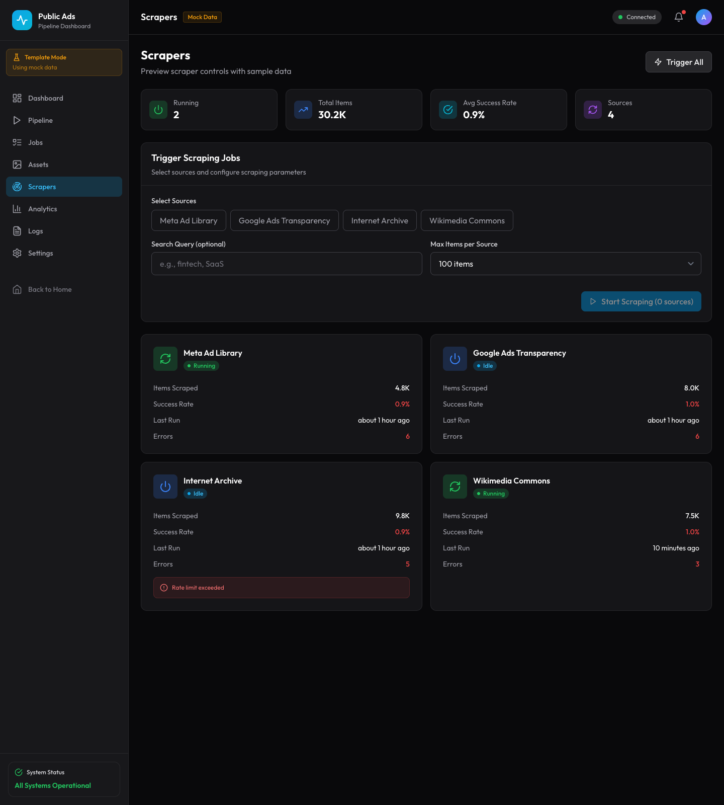
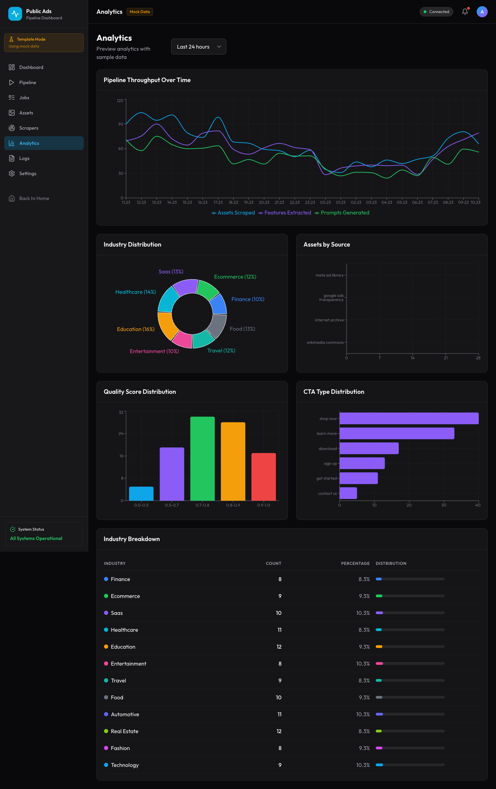
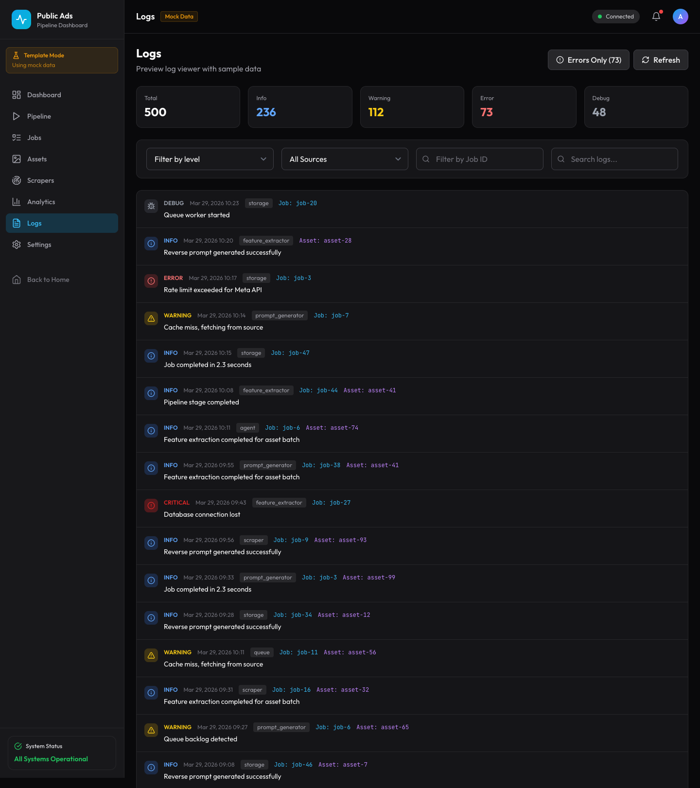

# Public Ads Scraper

Public Ads Platform is a local-first, cloud-optional system for collecting public advertising creatives, extracting structured features, classifying industries, and generating reusable reverse prompts.

This repository combines browser automation, Python orchestration, frontend monitoring, validation workflows, and deployment infrastructure in a single project. The application source lives under `platform/`, but this root README is the canonical documentation entry point for the repository.

## Overview

The platform is designed to support an end-to-end workflow for public ad analysis:

1. collect public creatives from multiple sources
2. store assets and metadata through local or cloud-backed adapters
3. extract reusable visual and structural features
4. classify industries and creative patterns
5. generate reverse prompts from structured signals
6. inspect pipeline activity through APIs, dashboards, logs, and validation tooling

## Project Goals

- provide a local-first development experience with no mandatory cloud dependency
- support a cloud deployment path without maintaining a separate codebase
- make scraping and processing pipelines observable, testable, and reproducible
- keep the system usable on constrained development environments
- document architecture, validation, and operational workflows clearly

## Key Capabilities

- Multi-source scraping: Node.js and Playwright-based scrapers for public ad and asset collection
- Processing pipeline: Python services for orchestration, feature extraction, industry classification, and reverse prompting
- Local and cloud modes: interchangeable adapters for storage, queueing, monitoring, and inference
- Observability: dashboard views, WebSocket streaming, screenshot capture, health checks, and metrics endpoints
- Developer workflow: setup scripts, validation guides, manual testing procedures, and automated tests

## Architecture Snapshot

```text
┌─────────────────────────────────────────────────────────────────┐
│                       Dashboard Frontend                        │
│                    (React + Tailwind CSS)                       │
│  ┌──────────┐ ┌──────────┐ ┌──────────┐ ┌──────────┐            │
│  │   Jobs   │ │  Assets  │ │Analytics │ │   Logs   │            │
│  └────┬─────┘ └────┬─────┘ └────┬─────┘ └────┬─────┘            │
└───────┼────────────┼────────────┼────────────┼──────────────────┘
        │            │            │            │
        └────────────┴─────┬──────┴────────────┘
                           │
┌──────────────────────────┼──────────────────────────────────────┐
│                   Dashboard API (FastAPI)                       │
│  ┌──────────┐ ┌──────────┐ ┌──────────┐ ┌──────────┐            │
│  │ /jobs/*  │ │/assets/* │ │/metrics/*│ │ /logs/*  │            │
│  └────┬─────┘ └────┬─────┘ └────┬─────┘ └────┬─────┘            │
└───────┼────────────┼────────────┼────────────┼──────────────────┘
        │            │            │            │
┌───────┴────────────┴────────────┴────────────┴──────────────────┐
│                     Backend Services                            │
│  ┌──────────────┐  ┌──────────────┐  ┌──────────────┐           │
│  │  Agent Brain │  │   Scrapers   │  │   Feature    │           │
│  │   (Python)   │  │   (Node.js)  │  │  Extraction  │           │
│  └──────┬───────┘  └──────┬───────┘  └──────┬───────┘           │
└─────────┼─────────────────┼─────────────────┼───────────────────┘
          │                 │                 │
┌─────────┴─────────────────┴─────────────────┴───────────────────┐
│                        GCP Services                             │
│  ┌──────────┐ ┌──────────┐ ┌──────────┐ ┌──────────┐            │
│  │Firestore │ │  Storage │ │ Pub/Sub  │ │Vertex AI │            │
│  └──────────┘ └──────────┘ └──────────┘ └──────────┘            │
└─────────────────────────────────────────────────────────────────┘
```

## High-Level System Components

```text
+------------------------------------------------------------------------------+
| Frontend                                                                     |
| Stack: React + TypeScript + Vite                                             |
| Role: dashboard UI, controls, analytics, replay views                        |
+-----------------------------------+------------------------------------------+
                                    |
                                    v
+-----------------------------------+------------------------------------------+
| Dashboard Backend                                                            |
| Stack: FastAPI                                                               |
| Role: UI-facing API, health checks, metrics, proxy layer                     |
+-----------------------------------+------------------------------------------+
                                    |
                                    v
+-----------------------------------+------------------------------------------+
| Agent API + Orchestrator                                                      |
| Stack: Python + FastAPI                                                      |
| Role: job orchestration, mode detection, dependency injection                |
+-----------------------------------+------------------------------------------+
                                    |
                                    v
+-----------------------------------+------------------------------------------+
| Interface Contracts                                                          |
| StorageInterface | QueueInterface | LLMInterface | MonitoringInterface        |
+-----------------------------+---------------------+---------------------------+
                              |                     |
                              v                     v
        +--------------------------------+   +--------------------------------+
        | Local Adapters                 |   | Cloud Adapters                 |
        | JSON + filesystem              |   | Firestore + Cloud Storage      |
        | in-memory queue                |   | Pub/Sub + Vertex AI            |
        | templates / Ollama             |   | cloud monitoring               |
        +--------------------------------+   +--------------------------------+
                              \                     /
                               \                   /
                                v                 v
+------------------------------------------------------------------------------+
| Processing Pipeline                                                          |
| Playwright collection -> feature extraction -> classification -> prompts     |
+-----------------------------------+------------------------------------------+
                                    ^
                                    |
+-----------------------------------+------------------------------------------+
| Node.js Scraper Server                                                        |
| Stack: Node.js + Playwright + WebSocket streaming                            |
| Role: source scraping, browser control, live stream delivery                 |
+-----------------------------------+------------------------------------------+
                                    |
                                    v
+------------------------------------------------------------------------------+
| Playwright Browser                                                           |
| Role: public source collection, screenshot capture, live session frames      |
+------------------------------------------------------------------------------+
```

The system is organized in layers:

- Frontend: React dashboard for monitoring, controls, analytics, and replay views
- Dashboard backend: FastAPI layer that serves UI-facing data and system status
- Agent orchestration: Python services that coordinate jobs and bind adapters based on `MODE`
- Interfaces and adapters: storage, queue, LLM, and monitoring contracts with local and cloud implementations
- Scraping runtime: Node.js scraper service plus Playwright browser automation and live streaming
- Processing pipeline: feature extraction, industry classification, and reverse prompt generation

### Service Ports

| Service            | Port   | Purpose                          |
| ------------------ | ------ | -------------------------------- |
| Dashboard Frontend | `5173` | React UI                         |
| Dashboard Backend  | `8000` | API proxy and dashboard services |
| Agent API          | `8081` | Job orchestration                |
| Node.js Scraper    | `3001` | Scraping and live streaming      |

## Operating Modes

The platform supports two execution modes so the same codebase can serve both local development and cloud deployment.



### Local Mode

Local mode is the default. It is intended for development, validation, demos, and low-cost iteration.

| Component  | Implementation                       |
| ---------- | ------------------------------------ |
| Storage    | JSON files in `./data/db/`           |
| Files      | Local filesystem in `./data/assets/` |
| Queue      | In-memory                            |
| LLM        | Templates or optional Ollama         |
| Monitoring | Local logs and metrics files         |

### Cloud Mode

Cloud mode enables managed infrastructure for production-style operation.

| Component  | Implementation   |
| ---------- | ---------------- |
| Storage    | Cloud Firestore  |
| Files      | Cloud Storage    |
| Queue      | Cloud Pub/Sub    |
| LLM        | Vertex AI        |
| Monitoring | Cloud Monitoring |

### Vertex AI Restriction

Vertex AI is cloud-only in this project. Local mode is designed to stay reproducible, low-cost, and offline-capable.

```bash
# Local mode
MODE=local
LLM_MODE=template

# Cloud mode
MODE=cloud
GCP_PROJECT_ID=your-project-id
```

## Quick Start

### Prerequisites

- Python 3.11+
- Node.js 20+
- Docker (optional)
- Terraform 1.5+ for cloud provisioning

### Local Setup

```bash
cd /Users/monterey/Workspace/Projs/Tasmem/public-ads-scraping
npm run bootstrap

source platform/venv/bin/activate

npm run verify
```

Use [`LOCAL_BOOTSTRAP.md`](./LOCAL_BOOTSTRAP.md) for the full repo-level workflow, service startup commands, optional E2E setup, and orchestrator usage.

### Minimal Local Configuration

```bash
MODE=local
DATA_DIR=./data
LLM_MODE=template
MAX_BROWSER_INSTANCES=1
SEQUENTIAL_SCRAPING=true
GLOBAL_JOB_CAP=100
LOG_LEVEL=INFO
```

## AI-Assisted Workflow Model

This repository now includes a repo-native planning and execution workflow for AI-assisted coding. It ports the operating model from the source repository, but rewrites it for the Public Ads Platform architecture, commands, quality gates, and branch flow.

> This workflow acts like a control tower for repo changes: plan the work, track the state, run the gates, and keep branch promotion disciplined.

### Workflow At A Glance



### What It Adds

- root bootstrap and verification commands so contributors can work from the repository root
- human-readable planning documents for system definition, execution sequencing, and task tracking
- machine-readable state files for progress, verification status, and orchestrator sync
- a lightweight orchestrator that reports task coverage and runtime state without forcing a heavyweight scheduler
- practical contributor guardrails through pre-commit hooks, commit-message guidance, and CI

### Workflow Artifacts

| Artifact                                                                             | Purpose                                                                                    |
| ------------------------------------------------------------------------------------ | ------------------------------------------------------------------------------------------ |
| [`SPEC.md`](./SPEC.md)                                                               | Defines users, system requirements, and non-functional targets for the Public Ads Platform |
| [`AGENTS.md`](./AGENTS.md)                                                           | Breaks work into phases, dependencies, implementation surfaces, and acceptance criteria    |
| [`TASKS.md`](./TASKS.md)                                                             | Tracks the human task list with priorities and requirement links                           |
| [`STATE.json`](./STATE.json)                                                         | Stores machine-readable project progress and verification results                          |
| [`ORCHESTRATOR_STATE.json`](./ORCHESTRATOR_STATE.json)                               | Stores orchestrator task state, quality gates, and coverage                                |
| [`LOCAL_BOOTSTRAP.md`](./LOCAL_BOOTSTRAP.md)                                         | Canonical local setup, service startup, validation, and E2E guidance                       |
| [`docs/developer-onboarding/workflows.md`](./docs/developer-onboarding/workflows.md) | Day-to-day branch, validation, and release workflow                                        |
| [`docs/COMMIT_MESSAGES.md`](./docs/COMMIT_MESSAGES.md)                               | Commit-message conventions for this repository                                             |

### Standard Contributor Loop

```bash
npm run bootstrap
source platform/venv/bin/activate
npm run verify
```

The default verify path is intentionally practical for the current repo:

- `lint`: root formatting plus scraper, frontend, and orchestrator lint
- `typecheck`: frontend and orchestrator TypeScript checks, with Python typing debt tracked separately
- `test`: deterministic Python tests and scraper test discovery
- `security`: dependency integrity and high-signal secret scanning
- `build`: Python compile checks, dashboard build, and orchestrator build

### Orchestrator Commands

Use the lightweight orchestrator when you want the machine state to mirror the planning docs:

```bash
npm run orchestrator:sync
npm run orchestrator:status
npm run orchestrator:coverage
```

These commands read `SPEC.md`, `TASKS.md`, `STATE.json`, and `ORCHESTRATOR_STATE.json` and report whether task coverage and progress tracking are still aligned.

### Branch and Review Flow

The workflow keeps the repository's existing promotion model explicit:

- feature work lands through pull requests
- shared branch flow is `develop -> staging -> main`
- contributors should update planning and bootstrap docs when setup, validation, or runtime behavior changes

For the full local workflow, service startup commands, and optional end-to-end setup, use [`LOCAL_BOOTSTRAP.md`](./LOCAL_BOOTSTRAP.md).

## Dashboard

The dashboard is the main operational interface for the platform. It covers:

- job control and queue visibility
- scraper status and trigger controls
- asset review and prompt inspection
- analytics and trend monitoring
- logs, health checks, and administrative settings

The screenshot gallery below was captured from the template-mode routes (`/template/*`) so the interface can be reviewed in stable mock-data states.

### Landing Page



The landing page introduces the platform, explains the pipeline stages, and links into the main dashboard surfaces.

### Dashboard Overview



The overview page summarizes throughput, queue health, recent jobs, and industry distribution.

### Pipeline Control



The pipeline page is the execution surface for coordinating scrape, extract, classify, and prompt-generation flows.

### Jobs



The jobs page focuses on queue state, bulk job actions, and lifecycle monitoring.

### Scrapers



The scrapers page exposes source-level controls, runtime status, and performance monitoring.

### Analytics



The analytics page visualizes higher-level trends across throughput, quality, source mix, and CTA behavior.

### Logs



The logs page supports operational debugging with searchable, filterable application events.

## Repository Structure

```text
platform/
├── agent/                  # Python orchestration and adapters
├── scrapers/               # Node.js Playwright scrapers
├── feature_extraction/     # Feature extraction logic
├── reverse_prompt/         # Reverse-prompt generation
├── dashboard/              # Frontend, backend, and dashboard docs assets
├── docs/                   # Architecture and design docs
├── terraform/              # Cloud infrastructure
├── docker/                 # Container definitions
├── tests/                  # Test suites
└── data/                   # Local runtime data and placeholders
```

## Local Resource Profile

The platform is designed to run on constrained machines with conservative defaults.

```bash
MAX_BROWSER_INSTANCES=1
SEQUENTIAL_SCRAPING=true
GLOBAL_JOB_CAP=100
MAX_QUEUE_SIZE=1000
MAX_ASSETS_IN_MEMORY=50
IMAGE_ONLY_MODE=true
```

Minimum guidance:

- CPU: 2 cores
- RAM: 2 GB minimum, 4 GB recommended
- Disk: 10 GB free

## Deployment

### Docker

```bash
cd platform
docker-compose up
```

Optional profiles:

- `docker-compose --profile emulators up`
- `docker-compose --profile ollama up`

### Terraform

```bash
cd platform/terraform
terraform init
terraform plan -var="project_id=your-project-id"
terraform apply -var="project_id=your-project-id"
```

Cloud deployment assumes GCP services such as Firestore, Pub/Sub, Cloud Storage, and Vertex AI are available and configured.

## Documentation Index

Core documentation:

- Repo workflow bootstrap: [`LOCAL_BOOTSTRAP.md`](./LOCAL_BOOTSTRAP.md)
- AI-assisted planning and execution: [`SPEC.md`](./SPEC.md), [`AGENTS.md`](./AGENTS.md), [`TASKS.md`](./TASKS.md)
- Machine state and orchestrator runtime: [`STATE.json`](./STATE.json), [`ORCHESTRATOR_STATE.json`](./ORCHESTRATOR_STATE.json)
- Contributor workflow and branch model: [`docs/developer-onboarding/workflows.md`](./docs/developer-onboarding/workflows.md)
- Commit message guide: [`docs/COMMIT_MESSAGES.md`](./docs/COMMIT_MESSAGES.md)
- Local validation and service bring-up: [`platform/LOCAL_VALIDATION.md`](./platform/LOCAL_VALIDATION.md)
- Manual testing walkthrough: [`platform/MANUAL_TESTING.md`](./platform/MANUAL_TESTING.md)
- Local runtime data guidance: [`platform/data/README.md`](./platform/data/README.md)

Dashboard documentation:

- Dashboard overview and screenshot walkthrough: [`platform/dashboard/README.md`](./platform/dashboard/README.md)
- Dashboard user guide: [`platform/dashboard/frontend/DASHBOARD_GUIDE.md`](./platform/dashboard/frontend/DASHBOARD_GUIDE.md)

Architecture documentation:

- System architecture: [`platform/docs/architecture.md`](./platform/docs/architecture.md)
- Pipeline data flow: [`platform/docs/data_flow.md`](./platform/docs/data_flow.md)
- Local versus cloud mode comparison: [`platform/docs/local_vs_cloud.md`](./platform/docs/local_vs_cloud.md)
- Agent pipeline state machine: [`platform/docs/state_machine.md`](./platform/docs/state_machine.md)

Contribution and governance:

- Contribution guidelines: [`CONTRIBUTING.md`](./CONTRIBUTING.md)
- Code of conduct: [`CODE_OF_CONDUCT.md`](./CODE_OF_CONDUCT.md)
- Security policy: [`SECURITY.md`](./SECURITY.md)
- License: [`LICENSE`](./LICENSE)

## Contributing

Contributors should begin with [`CONTRIBUTING.md`](./CONTRIBUTING.md), then use the validation and testing docs to verify local changes. Changes that affect setup, runtime behavior, scraping workflows, dashboard behavior, or deployment paths should include corresponding documentation updates.
