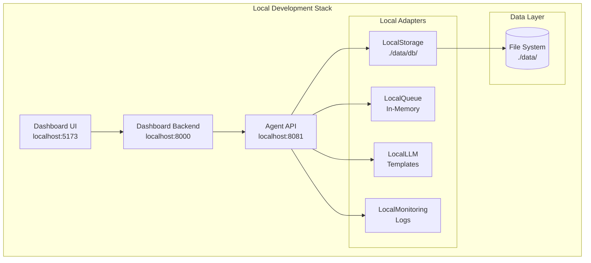
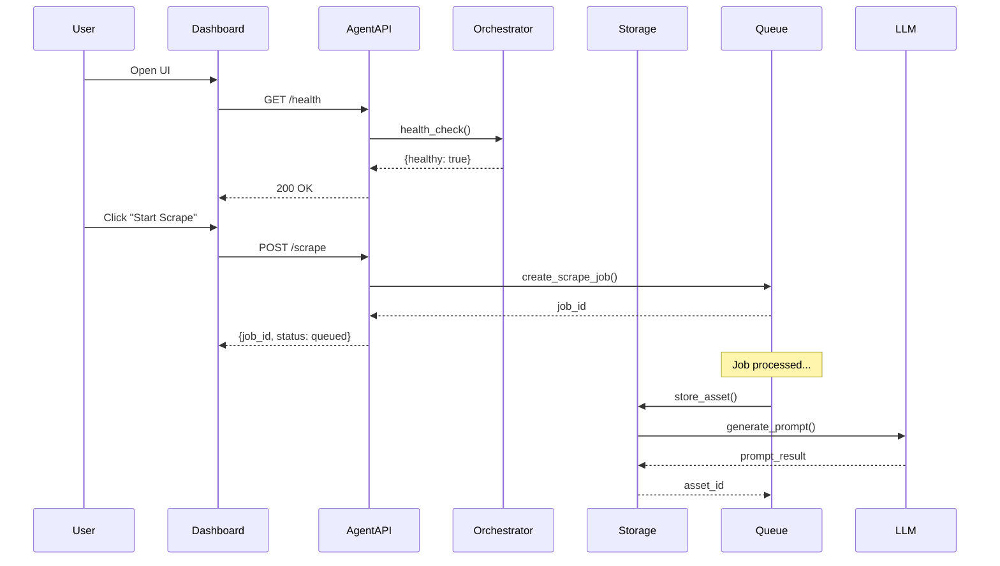
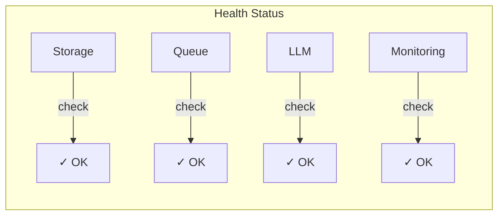

# Creative Ads Platform - Local Validation Guide

## 🏗️ Architecture Overview



---

## 📋 Pre-Flight Checklist

| Component | Required | Check Command |
|-----------|----------|---------------|
| Python 3.9+ | ✅ | `python3 --version` |
| Node.js 18+ | ✅ | `node --version` |
| npm | ✅ | `npm --version` |
| Virtual Env | ✅ | `ls venv/` |

---

## 🚀 Step-by-Step Testing

### Step 1: Navigate to Project

```bash
cd /Users/monterey/Workspace/Projs/Tasmem/tasmem-scraping/creative-ads-platform
```

### Step 2: Set Environment Variables

```bash
export MODE=local
export DATA_DIR=./data
export LLM_MODE=template
```

### Step 3: Run Validation Script

```bash
./venv/bin/python scripts/validate.py
```

**Expected Output:**
```
✓ Python 3.13.2
✓ All directories exist
✓ All modules import
✓ Local adapters working
ALL CHECKS PASSED! ✓
```

### Step 4: Test Core Pipeline

```bash
./venv/bin/python -c "
import asyncio
from agent.config import Config
from agent.orchestrator import Orchestrator

async def test():
    print('1. Loading config...')
    config = Config.from_environment()
    print(f'   Mode: {config.mode.value}')
    
    print('2. Initializing orchestrator...')
    orch = Orchestrator(config)
    await orch.initialize()
    
    print('3. Testing storage...')
    storage = orch.get_storage()
    await storage.store_asset('test-1', {'source': 'test', 'title': 'Test'})
    asset = await storage.get_asset('test-1')
    print(f'   Stored & retrieved: {asset.title}')
    
    print('4. Testing queue...')
    queue = orch.get_queue()
    job_id = await queue.create_scrape_job('meta_ad_library', 'tech')
    print(f'   Created job: {job_id[:8]}...')
    
    print('5. Testing LLM...')
    llm = orch.get_llm()
    result = await llm.generate_prompt({'layout_type': 'hero'}, 'ecommerce')
    print(f'   Generated prompt: {result.positive[:50]}...')
    
    print('6. Health check...')
    health = await orch.health_check()
    print(f'   Healthy: {health[\"healthy\"]}')
    
    await storage.delete_asset('test-1')
    await orch.shutdown()
    print('\\n✅ ALL TESTS PASSED')

asyncio.run(test())
"
```

### Step 5: Start Agent API

**Terminal 1:**
```bash
cd /Users/monterey/Workspace/Projs/Tasmem/tasmem-scraping/creative-ads-platform
MODE=local ./venv/bin/uvicorn agent.api:app --host 0.0.0.0 --port 8081 --reload
```

**Expected:**
```
INFO:     Uvicorn running on http://0.0.0.0:8081
INFO:     Initializing Orchestrator in local mode...
INFO:     Agent API initialized (mode=local)
```

### Step 6: Test Agent API Endpoints

**Terminal 2:**
```bash
# Health check
curl http://localhost:8081/health

# List sources
curl http://localhost:8081/sources

# Create a scraping job
curl -X POST http://localhost:8081/scrape \
  -H "Content-Type: application/json" \
  -d '{"source": "meta_ad_library", "max_items": 10}'

# Get queue size
curl http://localhost:8081/queue/size

# Get metrics
curl http://localhost:8081/metrics
```

### Step 7: Start Dashboard Backend

**Terminal 3:**
```bash
cd /Users/monterey/Workspace/Projs/Tasmem/tasmem-scraping/creative-ads-platform/dashboard/backend
source venv/bin/activate
uvicorn app.main:app --host 0.0.0.0 --port 8000 --reload
```

### Step 8: Start Dashboard Frontend

**Terminal 4:**
```bash
cd /Users/monterey/Workspace/Projs/Tasmem/tasmem-scraping/creative-ads-platform/dashboard/frontend
npm run dev
```

### Step 9: Access Dashboard

Open browser to: **http://localhost:5173**

---

## 🔄 Data Flow Diagram



---

## 📊 Component Health Matrix



---

## 🧪 Test Commands Summary

| Test | Command | Expected |
|------|---------|----------|
| Validate setup | `./venv/bin/python scripts/validate.py` | All checks pass |
| Agent health | `curl localhost:8081/health` | `{"status": "healthy"}` |
| Dashboard health | `curl localhost:8000/health` | `{"status": "healthy"}` |
| Create job | `curl -X POST localhost:8081/scrape -d '{...}'` | `{"job_id": "..."}` |
| Queue size | `curl localhost:8081/queue/size` | `{"size": N}` |

---

## 🌐 Service URLs

| Service | URL | Purpose |
|---------|-----|---------|
| Dashboard UI | http://localhost:5173 | Main control panel |
| Dashboard API | http://localhost:8000/docs | Backend Swagger |
| Agent API | http://localhost:8081/docs | Agent Swagger |

---

## 🐛 Troubleshooting

### Issue: Python version error
```bash
# Use the venv Python directly
./venv/bin/python --version
./venv/bin/python scripts/validate.py
```

### Issue: Port already in use
```bash
# Kill existing processes
pkill -f uvicorn
lsof -i :8081 | grep LISTEN
```

### Issue: Module not found
```bash
# Reinstall dependencies
./venv/bin/pip install -r requirements.txt
```

---

## ✅ Success Criteria

- [ ] Validation script passes all checks
- [ ] Agent API responds to `/health`
- [ ] Can create scraping jobs via API
- [ ] Dashboard frontend loads
- [ ] Dashboard can communicate with Agent API

