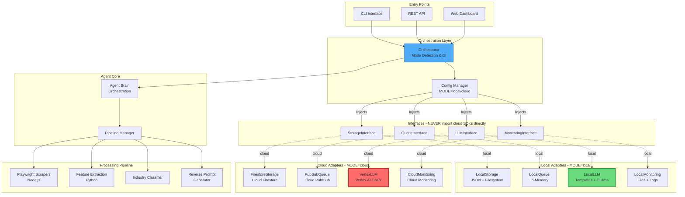
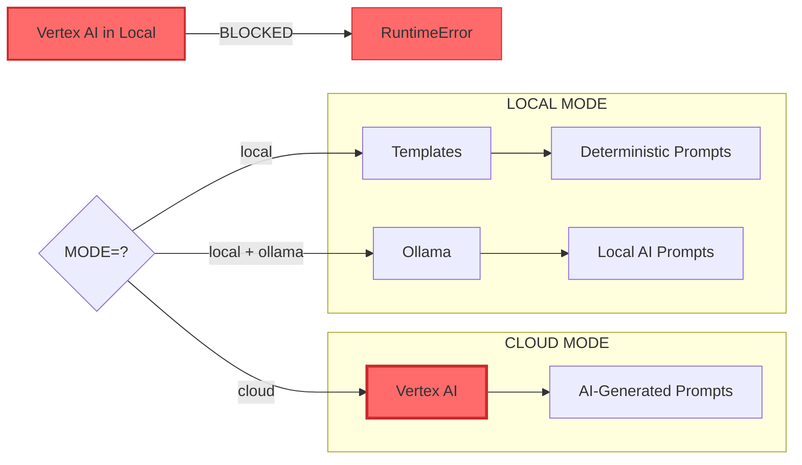
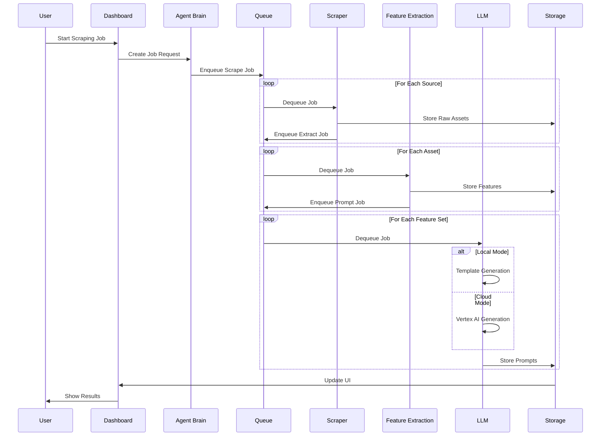

# System Architecture

## Overview

The Creative Ads Platform is a **local-first, cloud-optional agentic system** for scraping, analyzing, and generating reverse prompts for creative advertisements.

## Architecture Diagram



## Key Design Principles

### 1. Local-First Development

The platform is designed to run **completely offline** without any cloud dependencies:

- All GCP services are emulated locally
- No GCP credentials required for local development
- Full functionality available on low-RAM machines

### 2. Strict Adapter Boundaries

**Business logic NEVER imports cloud SDKs directly.**

```python
# ❌ WRONG - Direct cloud import in business logic
from google.cloud import firestore
client = firestore.Client()

# ✅ CORRECT - Interface import, adapter injected
from agent.interfaces import StorageInterface

class MyService:
    def __init__(self, storage: StorageInterface):
        self.storage = storage
```

### 3. Vertex AI is CLOUD-ONLY



## Component Map

| Component | LOCAL MODE | CLOUD MODE |
|-----------|------------|------------|
| Agent Brain | Local Python | Cloud Run |
| Scrapers | Local Node.js | Cloud Run |
| Storage (Documents) | JSON Files | Firestore |
| Storage (Files) | Local FS | Cloud Storage |
| Queue | In-Memory | Pub/Sub |
| Reverse Prompt | Templates/Ollama | **Vertex AI** |
| Monitoring | Local Logs + UI | Cloud Monitoring |
| Auth | Disabled | IAM |

## Data Flow



## Directory Structure

```
creative-ads-platform/
├── agent/
│   ├── interfaces/          # Abstract interfaces (contracts)
│   │   ├── storage.py       # StorageInterface
│   │   ├── queue.py         # QueueInterface
│   │   ├── llm.py           # LLMInterface
│   │   └── monitoring.py    # MonitoringInterface
│   │
│   ├── adapters/
│   │   ├── local/           # Local implementations
│   │   │   ├── local_storage.py
│   │   │   ├── local_queue.py
│   │   │   ├── local_llm.py
│   │   │   └── local_monitoring.py
│   │   │
│   │   └── cloud/           # Cloud implementations
│   │       ├── firestore_storage.py
│   │       ├── pubsub_queue.py
│   │       ├── vertex_llm.py    # CLOUD ONLY!
│   │       └── cloud_monitoring.py
│   │
│   ├── agent_brain.py       # Core orchestration
│   ├── orchestrator.py      # DI container
│   └── config.py            # Configuration
│
├── scrapers/                # Node.js Playwright scrapers
├── feature_extraction/      # Python feature extraction
├── reverse_prompt/          # Prompt generation
│   ├── rules_engine.py      # Template-based
│   └── templates/           # Industry templates
├── dashboard/               # Web UI
├── docs/                    # Documentation
└── data/                    # Local data storage
```

