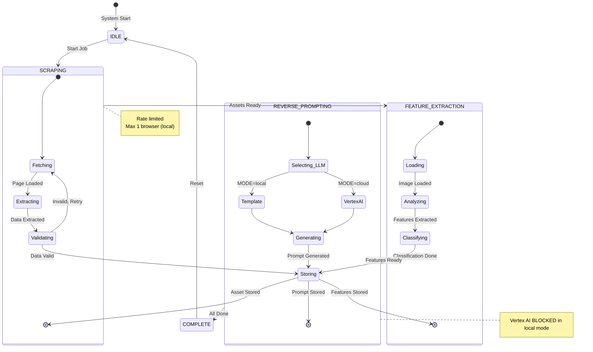
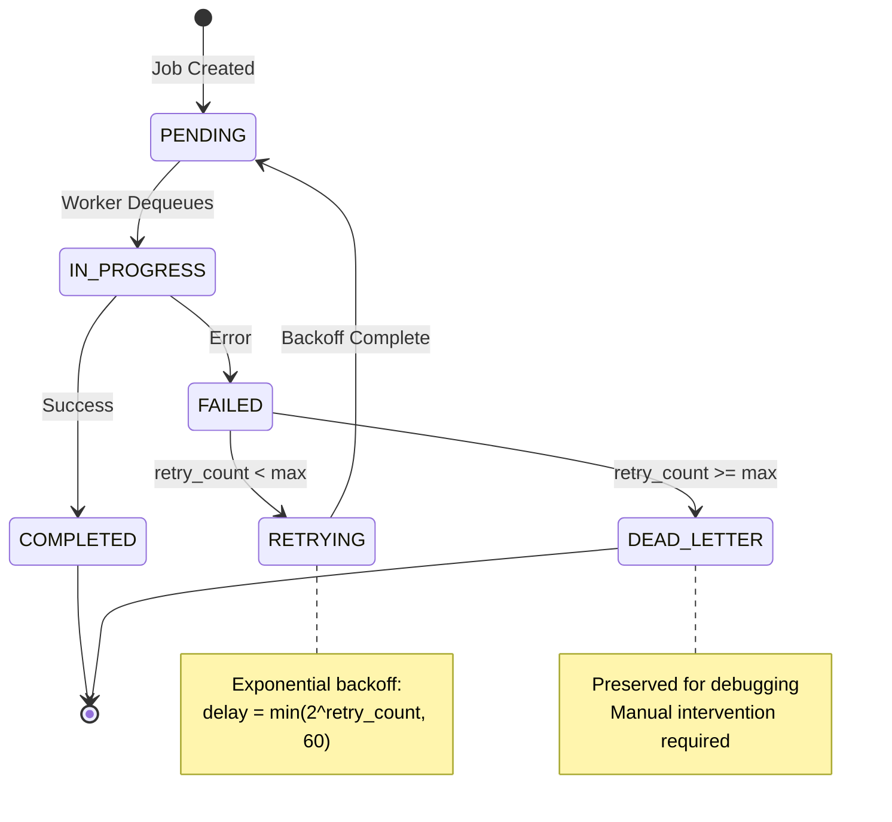
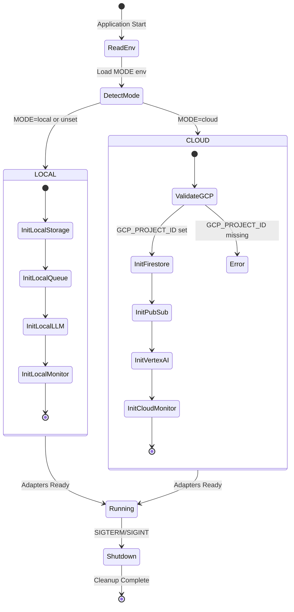
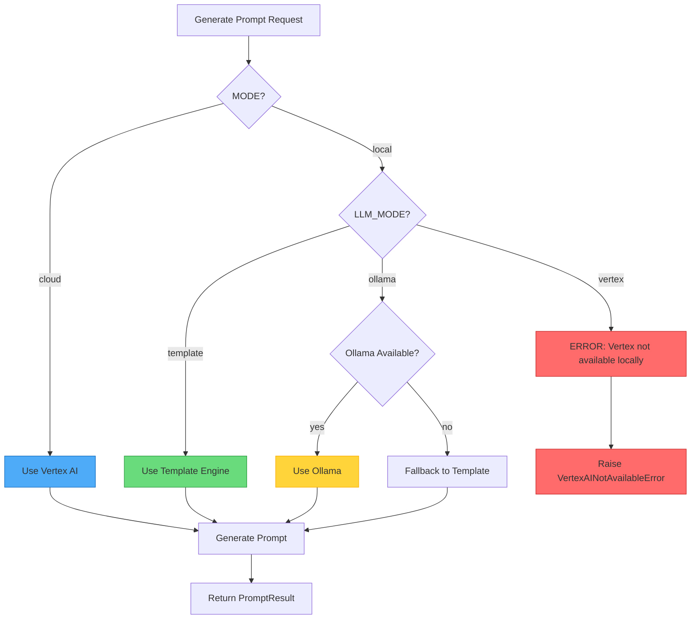
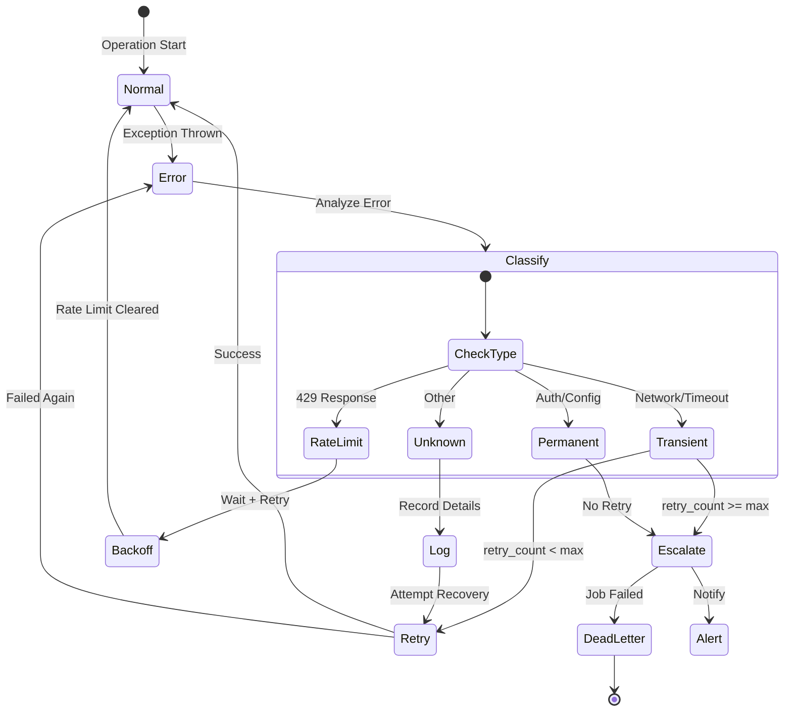

# Agent State Machine

## Pipeline Stage State Machine

```mermaid
stateDiagram-v2
    [*] --> IDLE: System Start
    
    IDLE --> SCRAPING: Start Job
    
    state SCRAPING {
        [*] --> Fetching
        Fetching --> Extracting: Page Loaded
        Extracting --> Validating: Data Extracted
        Validating --> Storing: Data Valid
        Validating --> Fetching: Invalid, Retry
        Storing --> [*]: Asset Stored
    }
    
    SCRAPING --> FEATURE_EXTRACTION: Assets Ready
    
    state FEATURE_EXTRACTION {
        [*] --> Loading
        Loading --> Analyzing: Image Loaded
        Analyzing --> Classifying: Features Extracted
        Classifying --> Storing: Classification Done
        Storing --> [*]: Features Stored
    }
    
    FEATURE_EXTRACTION --> REVERSE_PROMPTING: Features Ready
    
    state REVERSE_PROMPTING {
        [*] --> Selecting_LLM
        Selecting_LLM --> Template: MODE=local
        Selecting_LLM --> VertexAI: MODE=cloud
        Template --> Generating
        VertexAI --> Generating
        Generating --> Storing: Prompt Generated
        Storing --> [*]: Prompt Stored
    }
    
    REVERSE_PROMPTING --> COMPLETE: All Done
    
    COMPLETE --> IDLE: Reset
    
    note right of SCRAPING
        Rate limited
        Max 1 browser (local)
    end note
    
    note right of REVERSE_PROMPTING
        Vertex AI BLOCKED in local mode
    end note
```

## Job State Machine

```mermaid
stateDiagram-v2
    [*] --> PENDING: Job Created
    
    PENDING --> IN_PROGRESS: Worker Dequeues
    
    IN_PROGRESS --> COMPLETED: Success
    IN_PROGRESS --> FAILED: Error
    
    FAILED --> RETRYING: retry_count < max
    FAILED --> DEAD_LETTER: retry_count >= max
    
    RETRYING --> PENDING: Backoff Complete
    
    COMPLETED --> [*]
    DEAD_LETTER --> [*]
    
    note right of RETRYING
        Exponential backoff:
        delay = min(2^retry_count, 60)
    end note
    
    note right of DEAD_LETTER
        Preserved for debugging
        Manual intervention required
    end note
```

## Mode Switching State Machine

```mermaid
stateDiagram-v2
    [*] --> ReadEnv: Application Start
    
    ReadEnv --> DetectMode: Load MODE env
    
    DetectMode --> LOCAL: MODE=local or unset
    DetectMode --> CLOUD: MODE=cloud
    
    state LOCAL {
        [*] --> InitLocalStorage
        InitLocalStorage --> InitLocalQueue
        InitLocalQueue --> InitLocalLLM
        InitLocalLLM --> InitLocalMonitor
        InitLocalMonitor --> [*]
    }
    
    state CLOUD {
        [*] --> ValidateGCP
        ValidateGCP --> InitFirestore: GCP_PROJECT_ID set
        ValidateGCP --> Error: GCP_PROJECT_ID missing
        InitFirestore --> InitPubSub
        InitPubSub --> InitVertexAI
        InitVertexAI --> InitCloudMonitor
        InitCloudMonitor --> [*]
    }
    
    LOCAL --> Running: Adapters Ready
    CLOUD --> Running: Adapters Ready
    
    Running --> Shutdown: SIGTERM/SIGINT
    
    Shutdown --> [*]: Cleanup Complete
```

## LLM Selection Logic

```mermaid
flowchart TD
    Start[Generate Prompt Request] --> CheckMode{MODE?}
    
    CheckMode -->|local| CheckLLMMode{LLM_MODE?}
    CheckMode -->|cloud| UseVertex[Use Vertex AI]
    
    CheckLLMMode -->|template| UseTemplate[Use Template Engine]
    CheckLLMMode -->|ollama| CheckOllama{Ollama Available?}
    CheckLLMMode -->|vertex| BlockVertex[ERROR: Vertex not available locally]
    
    CheckOllama -->|yes| UseOllama[Use Ollama]
    CheckOllama -->|no| FallbackTemplate[Fallback to Template]
    
    UseVertex --> Generate[Generate Prompt]
    UseTemplate --> Generate
    UseOllama --> Generate
    FallbackTemplate --> Generate
    
    BlockVertex --> Error[Raise VertexAINotAvailableError]
    
    Generate --> Return[Return PromptResult]
    
    style BlockVertex fill:#ff6b6b,stroke:#c92a2a
    style Error fill:#ff6b6b,stroke:#c92a2a
    style UseVertex fill:#4dabf7,stroke:#1971c2
    style UseTemplate fill:#69db7c,stroke:#2f9e44
    style UseOllama fill:#ffd43b,stroke:#fab005
```

## Error Handling State Machine

```mermaid
stateDiagram-v2
    [*] --> Normal: Operation Start
    
    Normal --> Error: Exception Thrown
    
    Error --> Classify: Analyze Error
    
    state Classify {
        [*] --> CheckType
        CheckType --> Transient: Network/Timeout
        CheckType --> Permanent: Auth/Config
        CheckType --> RateLimit: 429 Response
        CheckType --> Unknown: Other
    }
    
    Transient --> Retry: retry_count < max
    Transient --> Escalate: retry_count >= max
    
    RateLimit --> Backoff: Wait + Retry
    
    Permanent --> Escalate: No Retry
    
    Unknown --> Log: Record Details
    Log --> Retry: Attempt Recovery
    
    Retry --> Normal: Success
    Retry --> Error: Failed Again
    
    Backoff --> Normal: Rate Limit Cleared
    
    Escalate --> DeadLetter: Job Failed
    Escalate --> Alert: Notify
    
    DeadLetter --> [*]
```

