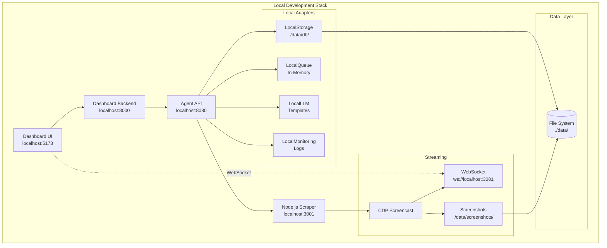
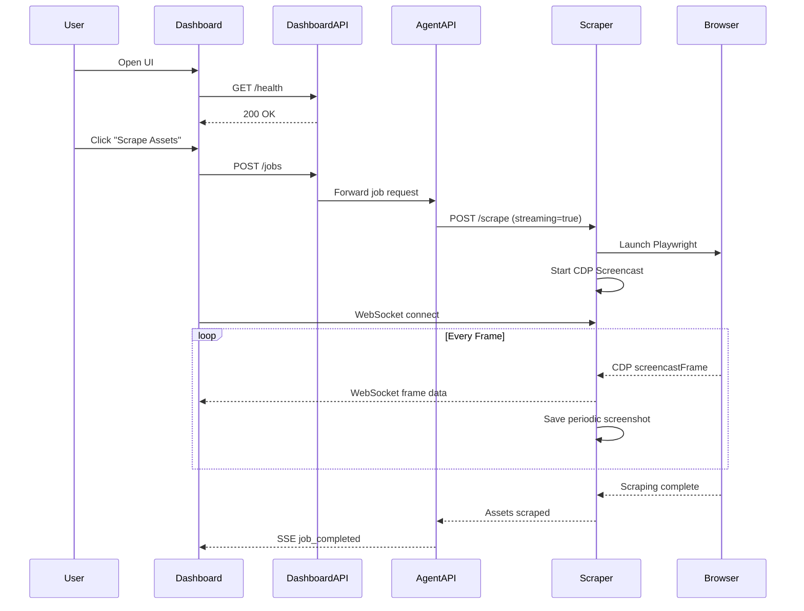
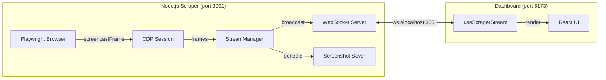
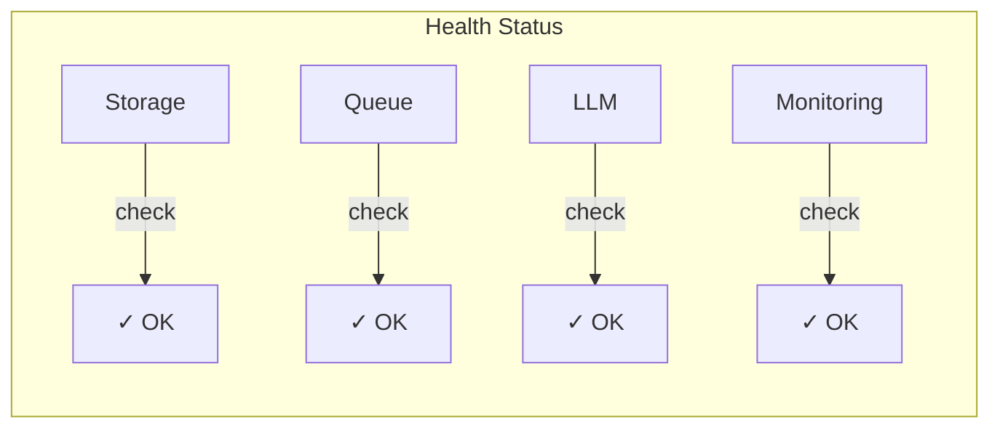

# Agentic Ads Platform - Local Validation Guide

## 🏗️ Architecture Overview



---

## 📋 Pre-Flight Checklist

| Component            | Required | Check Command                                 |
| -------------------- | -------- | --------------------------------------------- |
| Python 3.9+          | ✅       | `python3 --version`                           |
| Node.js 18+          | ✅       | `node --version` (use `nvm use 20` if needed) |
| npm                  | ✅       | `npm --version`                               |
| Python Virtual Env   | ✅       | `ls venv/`                                    |
| Scraper Dependencies | ✅       | `ls scrapers/node_modules/`                   |
| Playwright Browsers  | ✅       | `npx playwright install chromium`             |

---

## 🚀 Step-by-Step Testing

### Step 1: Navigate to Project

```bash
d ./platform
```

### Step 2: Set Environment Variables

```bash
export MODE=local
export DATA_DIR=./data
export LLM_MODE=template
```

### Step 3: Run Validation Script

```bash
./venv/bin/python scripts/validate.py
```

**Expected Output:**

```
✓ Python 3.13.2
✓ All directories exist
✓ All modules import
✓ Local adapters working
ALL CHECKS PASSED! ✓
```

### Step 4: Test Core Pipeline

```bash
./venv/bin/python -c "
import asyncio
from agent.config import Config
from agent.orchestrator import Orchestrator

async def test():
    print('1. Loading config...')
    config = Config.from_environment()
    print(f'   Mode: {config.mode.value}')

    print('2. Initializing orchestrator...')
    orch = Orchestrator(config)
    await orch.initialize()

    print('3. Testing storage...')
    storage = orch.get_storage()
    await storage.store_asset('test-1', {'source': 'test', 'title': 'Test'})
    asset = await storage.get_asset('test-1')
    print(f'   Stored & retrieved: {asset.title}')

    print('4. Testing queue...')
    queue = orch.get_queue()
    job_id = await queue.create_scrape_job('meta_ad_library', 'tech')
    print(f'   Created job: {job_id[:8]}...')

    print('5. Testing LLM...')
    llm = orch.get_llm()
    result = await llm.generate_prompt({'layout_type': 'hero'}, 'ecommerce')
    print(f'   Generated prompt: {result.positive[:50]}...')

    print('6. Health check...')
    health = await orch.health_check()
    print(f'   Healthy: {health[\"healthy\"]}')

    await storage.delete_asset('test-1')
    await orch.shutdown()
    print('\\n✅ ALL TESTS PASSED')

asyncio.run(test())
"
```

### Step 5: Start Node.js Scraper Server (with Live Streaming)

**Terminal 1:**

```bash
cd ./platform/scrapers
# Use Node.js 20+ for compatibility
source ~/.nvm/nvm.sh && nvm use 20
npm install  # First time only
node server.js
```

**Expected:**

```
info: StreamManager initialized
info: WebSocket server initialized on /ws/stream
info: Scraper server listening on 0.0.0.0:3001
info: WebSocket streaming available at ws://0.0.0.0:3001/ws/stream
```

### Step 6: Start Agent API

**Terminal 2:**

```bash
cd ./platform
MODE=local ./venv/bin/uvicorn agent.api:app --host 0.0.0.0 --port 8080 --reload
```

**Expected:**

```
INFO:     Uvicorn running on http://0.0.0.0:8080
INFO:     Initializing Orchestrator in local mode...
INFO:     Agent API initialized (mode=local)
```

### Step 7: Test Agent API Endpoints

**Terminal 3:**

```bash
# Health check
curl http://localhost:8080/health

# List sources
curl http://localhost:8080/sources

# Create a scraping job
curl -X POST http://localhost:8080/scrape \
  -H "Content-Type: application/json" \
  -d '{"source": "meta_ad_library", "max_items": 10}'

# Get queue size
curl http://localhost:8080/queue/size

# Get metrics
curl http://localhost:8080/metrics
```

### Step 8: Test Scraper Server Endpoints

```bash
# Health check
curl http://localhost:3001/health

# List sources
curl http://localhost:3001/sources

# Get active streaming sessions
curl http://localhost:3001/sessions/active

# Get sessions with screenshots (for replay)
curl http://localhost:3001/sessions/with-screenshots
```

### Step 9: Start Dashboard Backend

**Terminal 4:**

```bash
cd ./platform/dashboard/backend
source venv/bin/activate
uvicorn app.main:app --host 0.0.0.0 --port 8000 --reload
```

### Step 10: Start Dashboard Frontend

**Terminal 5:**

```bash
cd ./platform/dashboard/frontend
npm run dev
```

### Step 11: Access Dashboard

Open browser to: **http://localhost:5173**

### Step 12: Test Live Streaming

1. Navigate to **Pipeline** page in the dashboard
2. Click **"Scrape Assets"** to trigger a scraping job
3. Switch to **"Live View"** tab to watch the browser in real-time
4. After scraping completes, switch to **"Replays"** tab to view saved screenshots

---

## 🔄 Data Flow Diagram



## 🎥 Live Streaming Flow



---

## 📊 Component Health Matrix



---

## 🧪 Test Commands Summary

| Test             | Command                                         | Expected                |
| ---------------- | ----------------------------------------------- | ----------------------- |
| Validate setup   | `./venv/bin/python scripts/validate.py`         | All checks pass         |
| Agent health     | `curl localhost:8080/health`                    | `{"status": "healthy"}` |
| Scraper health   | `curl localhost:3001/health`                    | `{"status": "healthy"}` |
| Dashboard health | `curl localhost:8000/api/v1/health`             | `{"status": "healthy"}` |
| Create job       | `curl -X POST localhost:8080/scrape -d '{...}'` | `{"job_id": "..."}`     |
| Queue size       | `curl localhost:8080/queue/size`                | `{"size": N}`           |
| Active streams   | `curl localhost:3001/sessions/active`           | `{"sessions": [...]}`   |
| Replay sessions  | `curl localhost:3001/sessions/with-screenshots` | `{"sessions": [...]}`   |

---

## 🌐 Service URLs

| Service           | URL                           | Purpose              |
| ----------------- | ----------------------------- | -------------------- |
| Dashboard UI      | http://localhost:5173         | Main control panel   |
| Dashboard API     | http://localhost:8000/docs    | Backend Swagger      |
| Agent API         | http://localhost:8080/docs    | Agent Swagger        |
| Scraper HTTP      | http://localhost:3001         | Scraper REST API     |
| Scraper WebSocket | ws://localhost:3001/ws/stream | Live video streaming |

---

## 🐛 Troubleshooting

### Issue: Python version error

```bash
# Use the venv Python directly
./venv/bin/python --version
./venv/bin/python scripts/validate.py
```

### Issue: Port already in use

```bash
# Kill existing processes
pkill -f uvicorn
lsof -i :8081 | grep LISTEN
```

### Issue: Module not found

```bash
# Reinstall dependencies
./venv/bin/pip install -r requirements.txt
```

---

## ✅ Success Criteria

- [ ] Validation script passes all checks
- [ ] Agent API responds to `/health` on port 8080
- [ ] Scraper server responds to `/health` on port 3001
- [ ] Can create scraping jobs via API
- [ ] Dashboard frontend loads
- [ ] Dashboard can communicate with Agent API
- [ ] Live View shows active scraper sessions when scraping
- [ ] Screenshots are saved for replay in `./data/screenshots/`
- [ ] Replays tab shows completed sessions with screenshots
