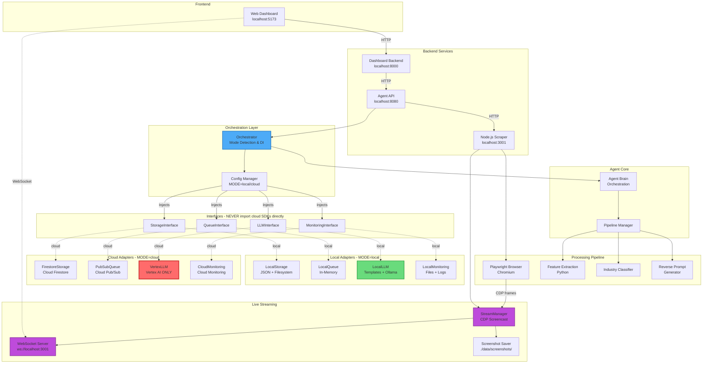
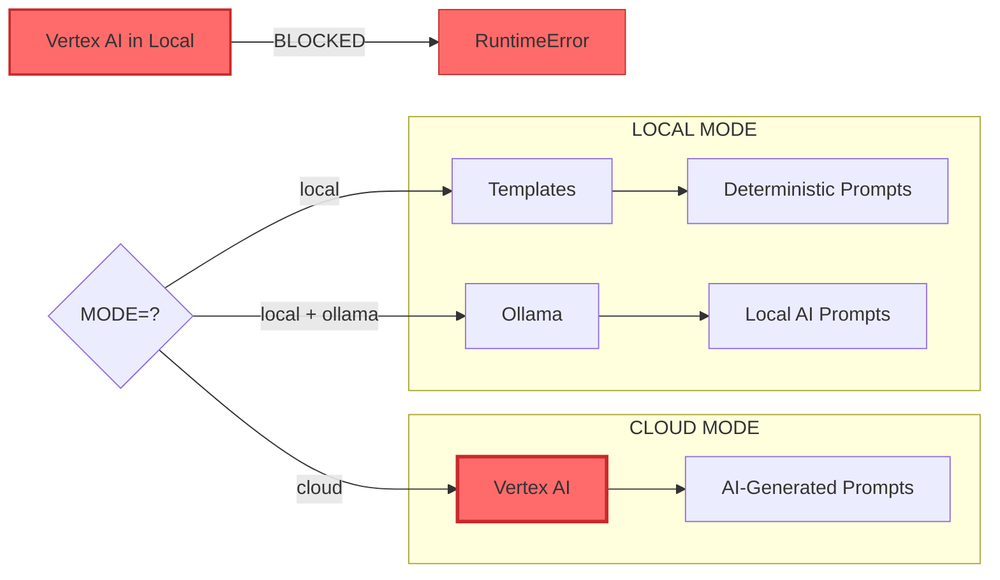
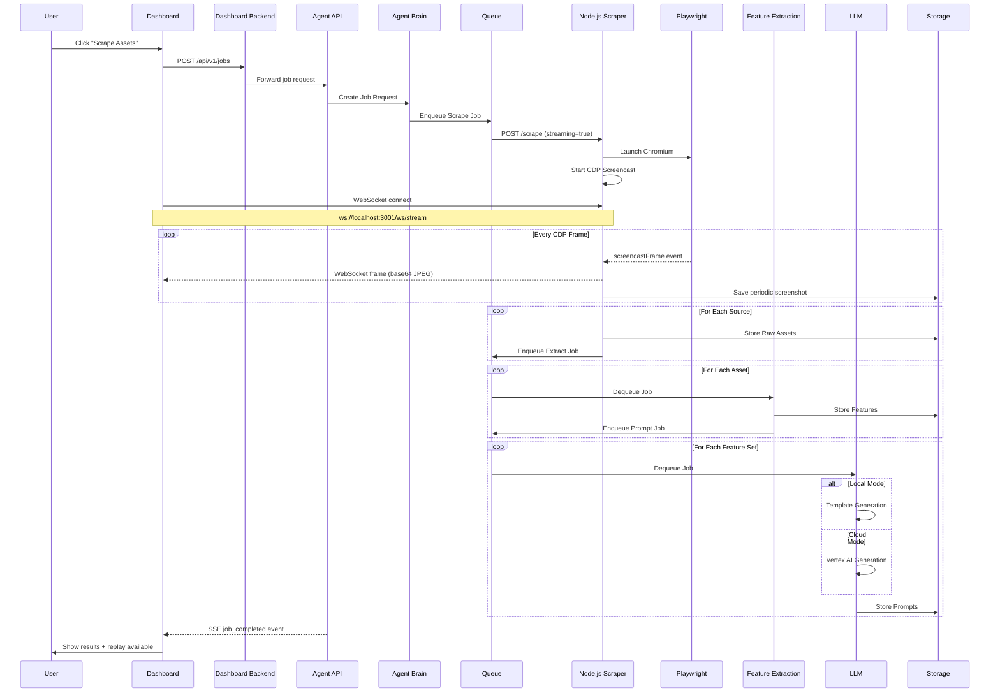
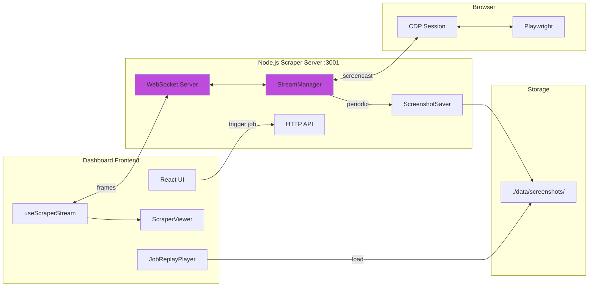

# System Architecture

## Overview

The Agentic Ads Platform is a **local-first, cloud-optional agentic system** for scraping, analyzing, and generating reverse prompts for creative advertisements. It features **real-time live streaming** of browser sessions for monitoring scraper activity.

## Architecture Diagram



## Service Ports

| Service            | Port | Protocol  | Purpose                   |
| ------------------ | ---- | --------- | ------------------------- |
| Dashboard Frontend | 5173 | HTTP      | React UI                  |
| Dashboard Backend  | 8000 | HTTP      | API proxy, SSE events     |
| Agent API          | 8080 | HTTP      | Job orchestration         |
| Node.js Scraper    | 3001 | HTTP + WS | Scraping + live streaming |

## Key Design Principles

### 1. Local-First Development

The platform is designed to run **completely offline** without any cloud dependencies:

- All GCP services are emulated locally
- No GCP credentials required for local development
- Full functionality available on low-RAM machines

### 2. Strict Adapter Boundaries

**Business logic NEVER imports cloud SDKs directly.**

```python
# ❌ WRONG - Direct cloud import in business logic
from google.cloud import firestore
client = firestore.Client()

# ✅ CORRECT - Interface import, adapter injected
from agent.interfaces import StorageInterface

class MyService:
    def __init__(self, storage: StorageInterface):
        self.storage = storage
```

### 3. Vertex AI is CLOUD-ONLY



## Component Map

| Component           | LOCAL MODE                | CLOUD MODE          |
| ------------------- | ------------------------- | ------------------- |
| Dashboard Frontend  | Vite dev server           | Cloud Run / GCS     |
| Dashboard Backend   | Uvicorn                   | Cloud Run           |
| Agent Brain         | Local Python              | Cloud Run           |
| Scrapers            | Local Node.js + WebSocket | Cloud Run           |
| Live Streaming      | CDP Screencast + WS       | CDP Screencast + WS |
| Storage (Documents) | JSON Files                | Firestore           |
| Storage (Files)     | Local FS                  | Cloud Storage       |
| Screenshots         | ./data/screenshots/       | Cloud Storage       |
| Queue               | In-Memory                 | Pub/Sub             |
| Reverse Prompt      | Templates/Ollama          | **Vertex AI**       |
| Monitoring          | Local Logs + UI           | Cloud Monitoring    |
| Auth                | Disabled                  | IAM                 |

## Data Flow



## Live Streaming Architecture



### Streaming Modes

| Mode       | Headless | Streaming | Use Case                      |
| ---------- | -------- | --------- | ----------------------------- |
| Production | `true`   | `true`    | Monitor scraping in dashboard |
| Debug      | `false`  | `false`   | Watch visible browser window  |
| Silent     | `true`   | `false`   | Fastest scraping, no overhead |

## Directory Structure

```
agentic-ads-platform/
├── agent/
│   ├── interfaces/          # Abstract interfaces (contracts)
│   │   ├── storage.py       # StorageInterface
│   │   ├── queue.py         # QueueInterface
│   │   ├── llm.py           # LLMInterface
│   │   └── monitoring.py    # MonitoringInterface
│   │
│   ├── adapters/
│   │   ├── local/           # Local implementations
│   │   │   ├── local_storage.py
│   │   │   ├── local_queue.py
│   │   │   ├── local_llm.py
│   │   │   └── local_monitoring.py
│   │   │
│   │   └── cloud/           # Cloud implementations
│   │       ├── firestore_storage.py
│   │       ├── pubsub_queue.py
│   │       ├── vertex_llm.py    # CLOUD ONLY!
│   │       └── cloud_monitoring.py
│   │
│   ├── services/            # Agent services
│   │   ├── stream_manager.py    # Live streaming (Python)
│   │   └── screenshot_saver.py  # Replay screenshots
│   │
│   ├── agent_brain.py       # Core orchestration
│   ├── orchestrator.py      # DI container
│   ├── api.py               # FastAPI endpoints (port 8080)
│   └── config.py            # Configuration
│
├── scrapers/                # Node.js Playwright scrapers
│   ├── scraper.js           # Base scraper + source scrapers
│   ├── server.js            # HTTP + WebSocket server (port 3001)
│   ├── streaming.js         # CDP screencast + StreamManager
│   └── utils.js             # Shared utilities
│
├── dashboard/
│   ├── backend/             # FastAPI backend (port 8000)
│   │   └── app/
│   │       ├── routers/
│   │       │   ├── jobs.py
│   │       │   ├── scrapers.py  # Proxies to Node.js scraper
│   │       │   └── events.py    # SSE for real-time updates
│   │       └── services/
│   │
│   └── frontend/            # React + Vite (port 5173)
│       └── src/
│           ├── components/
│           │   ├── ScraperViewer.tsx   # Live video player
│           │   ├── ScraperGrid.tsx     # Multi-scraper view
│           │   └── JobReplayPlayer.tsx # Screenshot replay
│           ├── hooks/
│           │   ├── useScraperStream.ts # WebSocket hook
│           │   ├── useJobScreenshots.ts
│           │   └── useEventStream.ts   # SSE hook
│           └── pages/
│               └── Pipeline.tsx        # Control + Live View
│
├── feature_extraction/      # Python feature extraction
├── reverse_prompt/          # Prompt generation
│   ├── rules_engine.py      # Template-based
│   └── templates/           # Industry templates
├── docs/                    # Documentation
└── data/                    # Local data storage
    ├── db/                  # JSON databases
    ├── screenshots/         # Scraper screenshots by session
    ├── logs/                # Pipeline logs
    └── metrics/             # System metrics
```
