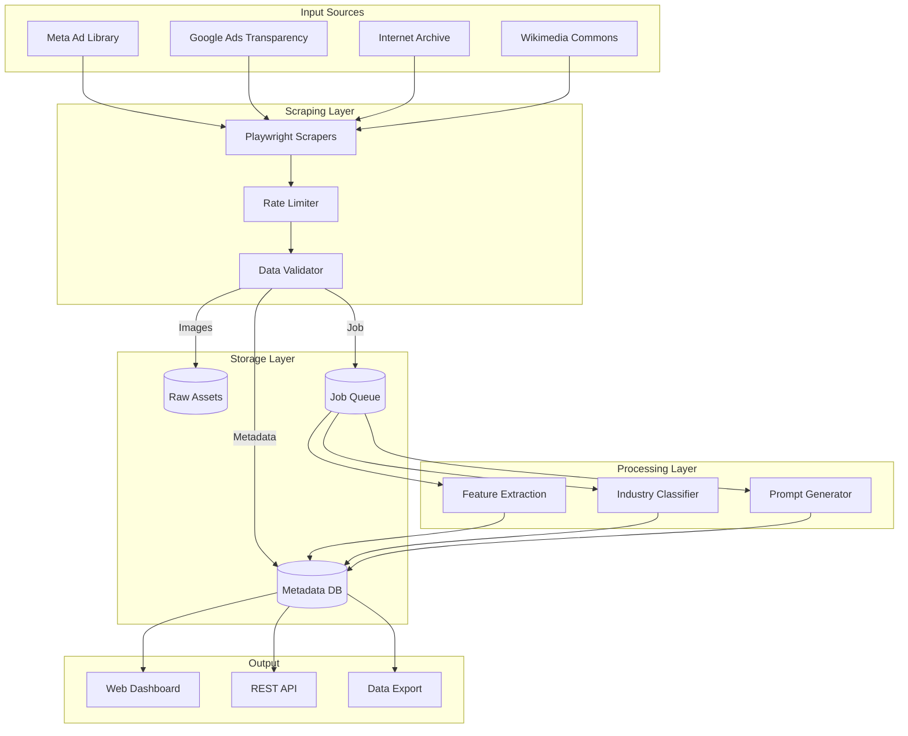
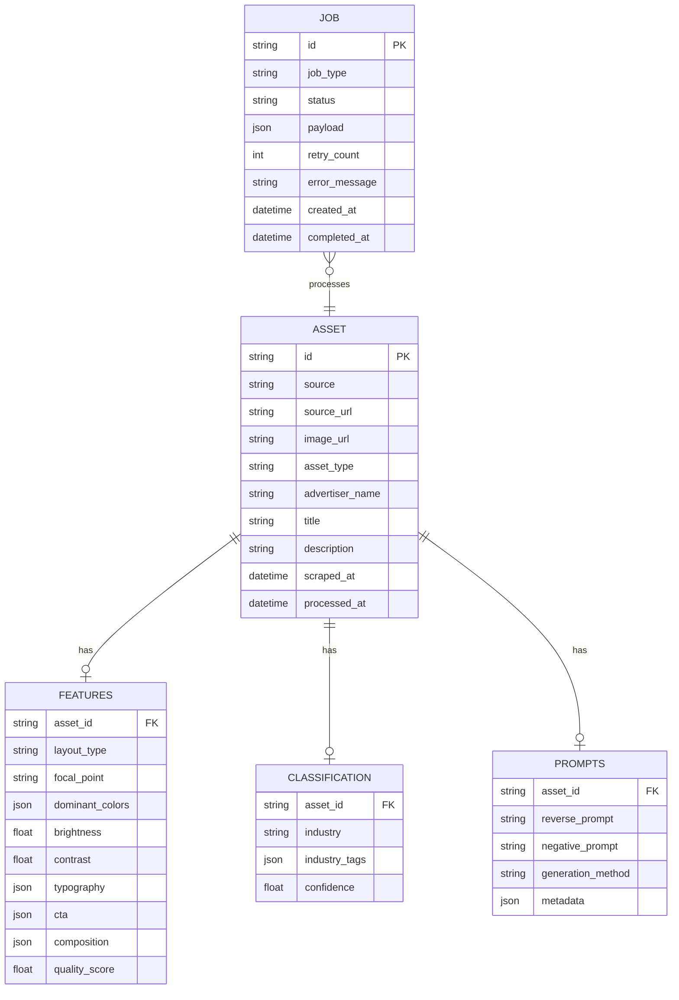
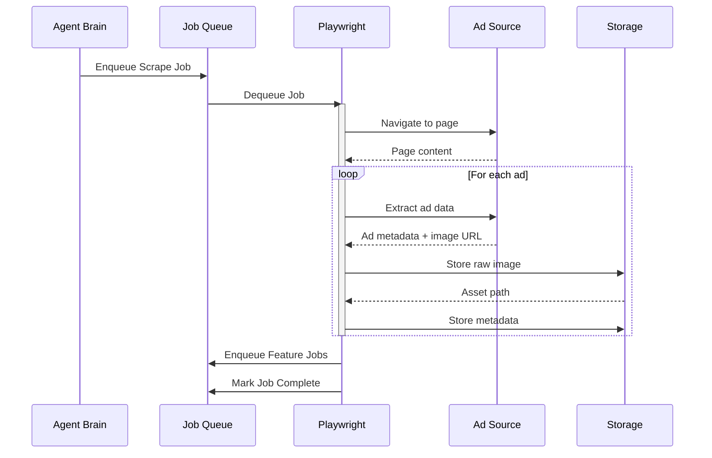
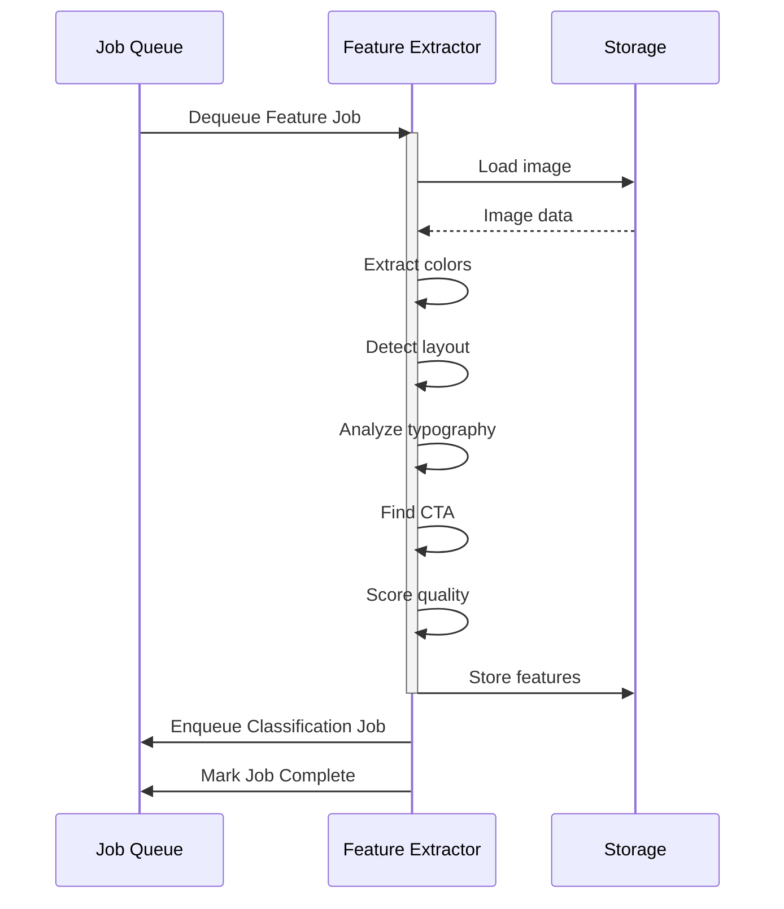
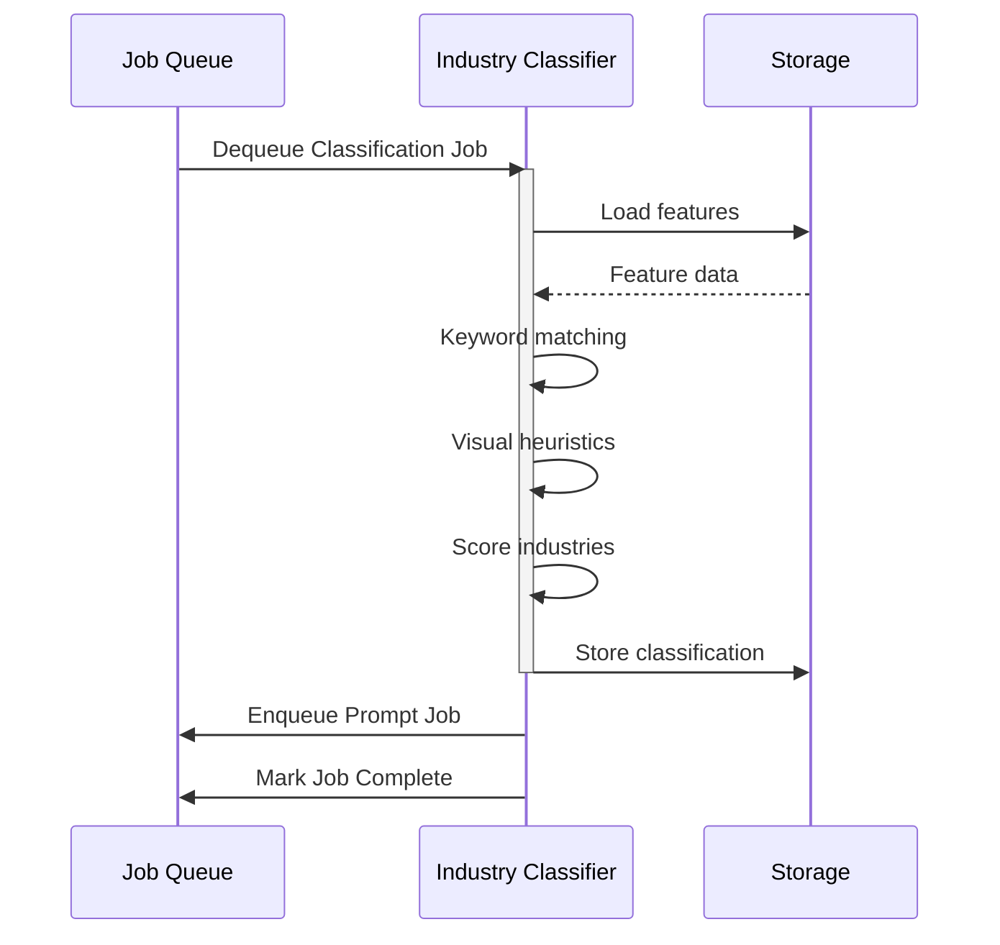
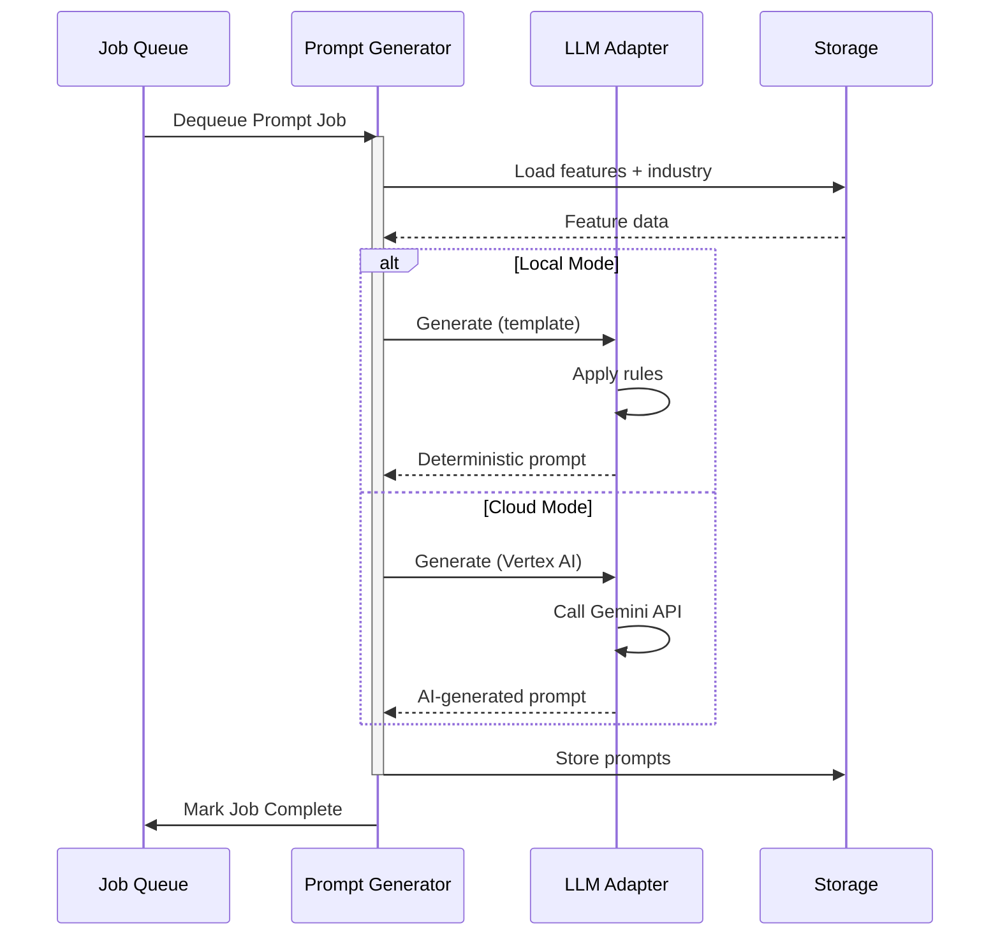

# Data Flow Documentation

## Overview

This document describes the data flow through the Agentic Ads Platform pipeline.

## End-to-End Data Flow



## Asset Data Model



## Pipeline Stages

### Stage 1: Scraping



### Stage 2: Feature Extraction



### Stage 3: Industry Classification



### Stage 4: Reverse Prompt Generation



## Data Transformations

### Raw Scrape → Validated Asset

```json
// Input: Raw scrape data
{
  "url": "https://example.com/ad/123",
  "imageUrl": "https://cdn.example.com/ad123.jpg",
  "text": "Shop now and save 50%!",
  "advertiser": "Example Store"
}

// Output: Validated asset
{
  "id": "meta-abc123def456",
  "source": "meta_ad_library",
  "source_url": "https://example.com/ad/123",
  "image_url": "https://cdn.example.com/ad123.jpg",
  "asset_type": "image",
  "advertiser_name": "Example Store",
  "title": "Shop now and save 50%!",
  "raw_asset_path": "./data/assets/raw/meta-abc123def456.jpg",
  "scraped_at": "2024-01-15T10:30:00Z"
}
```

### Asset → Features

```json
// Input: Asset with image
{
  "id": "meta-abc123def456",
  "image_url": "https://cdn.example.com/ad123.jpg"
}

// Output: Extracted features
{
  "asset_id": "meta-abc123def456",
  "layout_type": "hero",
  "focal_point": "product",
  "dominant_colors": [
    {"hex": "#2980b9", "percentage": 0.35},
    {"hex": "#ffffff", "percentage": 0.30}
  ],
  "overall_brightness": 0.72,
  "contrast_level": 0.65,
  "typography": {
    "has_headline": true,
    "estimated_readability": 0.85
  },
  "cta": {
    "detected": true,
    "type": "shop_now",
    "text": "Shop Now"
  },
  "quality_score": 0.88
}
```

### Features → Prompt

```json
// Input: Features + Industry
{
  "features": { /* ... */ },
  "industry": "ecommerce"
}

// Output: Reverse prompt
{
  "positive": "Advertisement creative: large hero image composition, prominent central subject, vibrant, enticing, product showcase, color palette featuring #2980b9, #ffffff, bright, well-lit, focus on product, clear CTA button: 'Shop Now', high quality, professional",
  "negative": "blurry, low quality, distorted, watermark, amateur, dull colors, complex backgrounds",
  "metadata": {
    "generation_method": "template",
    "industry": "ecommerce",
    "confidence": 0.75
  }
}
```

## Storage Schemas

### Local Mode (JSON)

```
data/
├── db/
│   ├── creative_ads_assets.json      # Asset metadata
│   ├── creative_ads_jobs.json        # Job records
│   └── creative_ads_metrics.json     # Aggregated metrics
│
├── assets/
│   ├── raw/                          # Original images
│   │   ├── meta-abc123.jpg
│   │   └── google-xyz789.png
│   │
│   └── processed/                    # Processed images
│       └── meta-abc123.webp
│
├── logs/
│   ├── logs_20240115.json
│   └── logs_20240116.json
│
└── metrics/
    └── metrics_20240115.json
```

### Cloud Mode (GCP)

```
Firestore:
├── creative_ads_assets/              # Asset documents
├── creative_ads_jobs/                # Job documents
└── creative_ads_metrics/             # Metric documents

Cloud Storage:
├── {project}-raw-assets/
│   └── assets/
│       └── meta-abc123.jpg
│
└── {project}-processed-assets/
    └── processed/
        └── meta-abc123.webp

Pub/Sub:
├── agentic-ads-jobs                 # Main job topic
├── agentic-ads-jobs-sub             # Subscription
└── agentic-ads-jobs-dlq             # Dead letter queue
```
