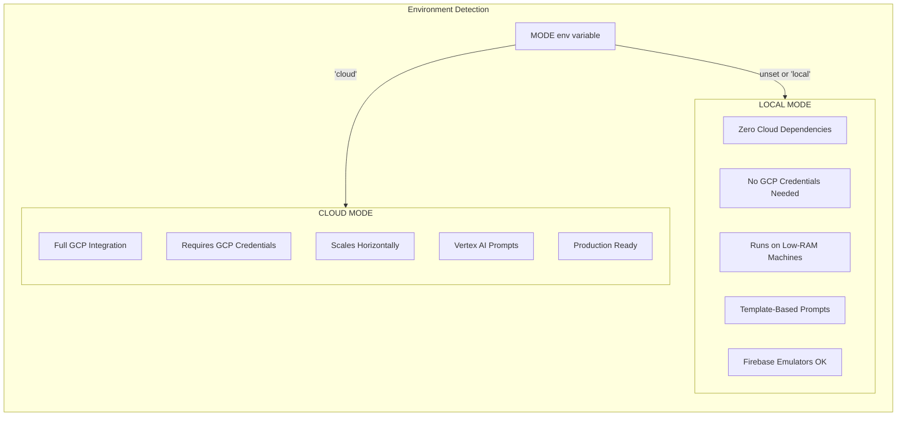
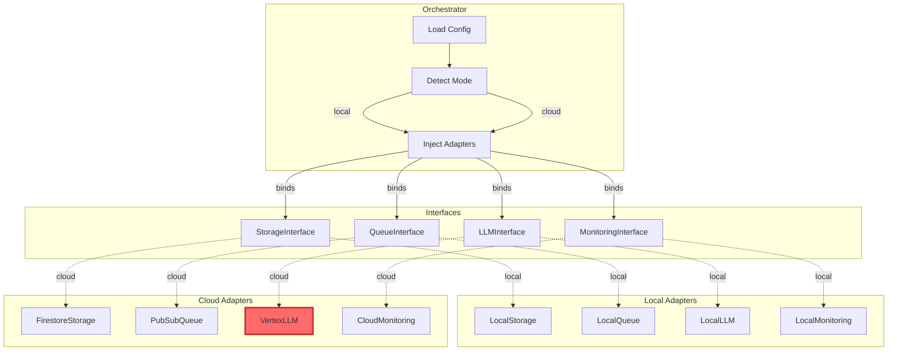
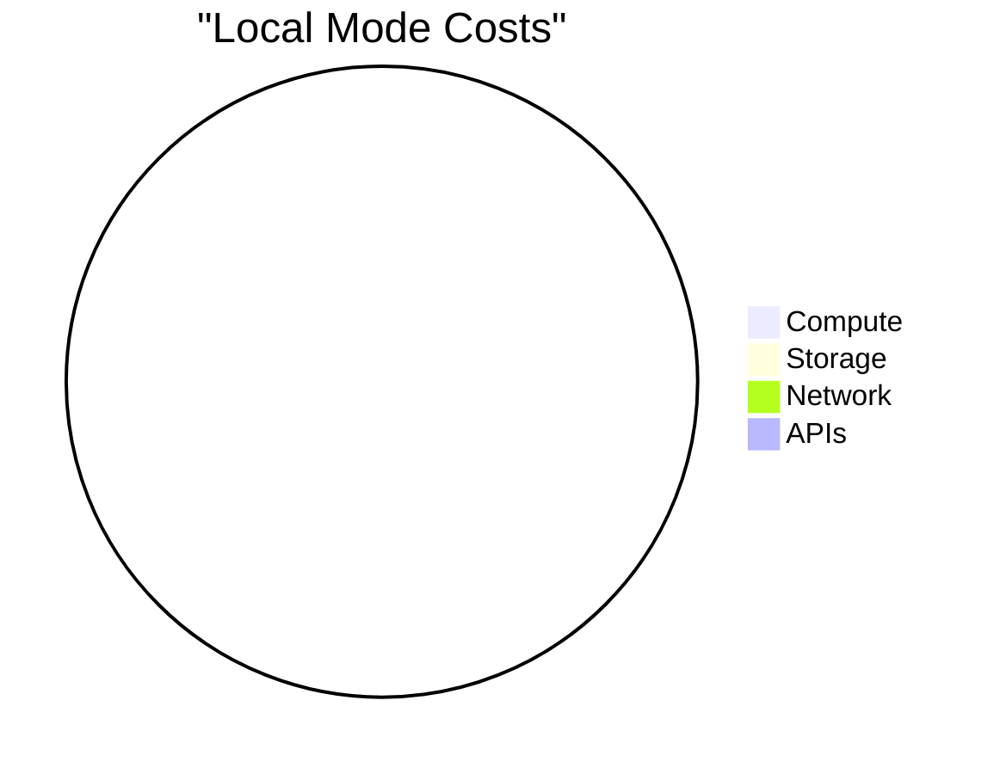
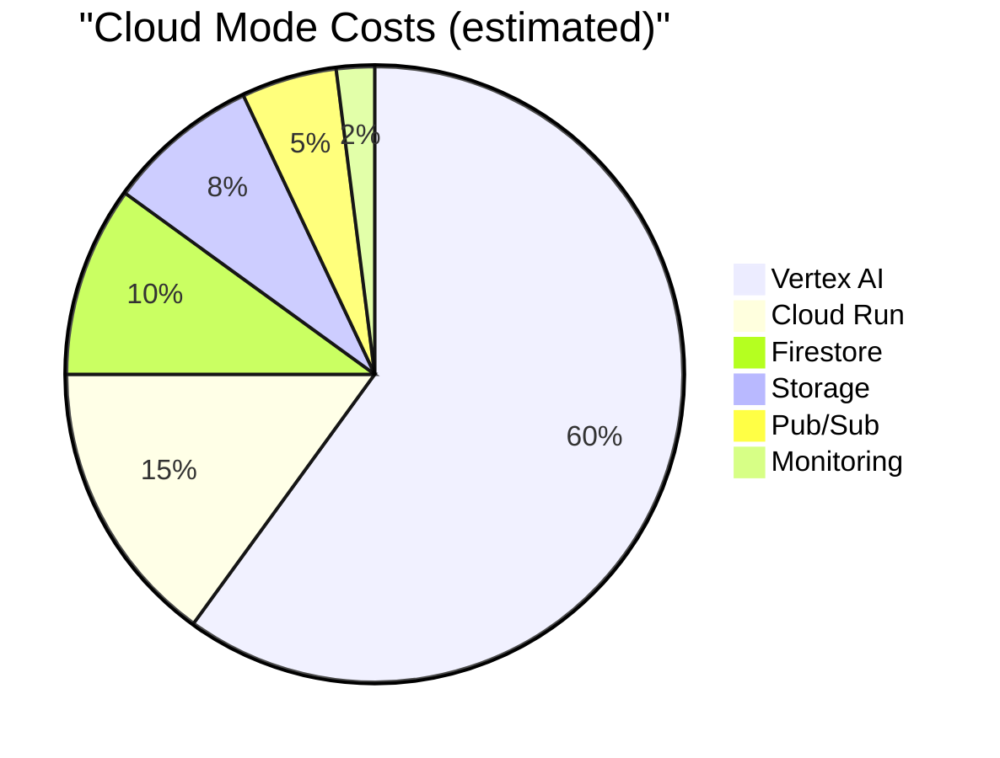

# Local vs Cloud Mode Comparison

## Mode Selection



## Component Comparison

| Component            | Local Mode                        | Cloud Mode             |
| -------------------- | --------------------------------- | ---------------------- |
| **Document Storage** | JSON files in `./data/db/`        | Cloud Firestore        |
| **File Storage**     | Local filesystem `./data/assets/` | Cloud Storage buckets  |
| **Job Queue**        | In-memory deque                   | Cloud Pub/Sub          |
| **LLM/Prompts**      | Templates + optional Ollama       | **Vertex AI (Gemini)** |
| **Monitoring**       | Local logs + metrics files        | Cloud Monitoring       |
| **Logging**          | stdout + file                     | Cloud Logging          |
| **Auth**             | Disabled                          | IAM/Service Accounts   |
| **Secrets**          | `.env` file                       | Secret Manager         |

## Adapter Injection



## Vertex AI Restriction

### Why Vertex AI is Cloud-Only

1. **Cost Control**: Prevents accidental API charges during development
2. **Reproducibility**: Template-based prompts are deterministic
3. **Offline Development**: Full functionality without internet
4. **Testing**: Consistent outputs for unit/integration tests

### Enforcement Mechanism

```python
# In VertexLLM adapter
class VertexLLM(LLMInterface):
    def __init__(self, ...):
        # CRITICAL: Check mode immediately in constructor
        self._validate_mode()

    def _validate_mode(self):
        mode = os.environ.get("MODE", "local").lower()
        if mode != "cloud":
            raise VertexAINotAvailableError(
                "Vertex AI is NOT available in local mode. "
                "Set MODE=cloud for Vertex AI."
            )
```

### Local Alternatives

| Vertex AI Feature | Local Alternative   |
| ----------------- | ------------------- |
| Gemini Pro        | Template Engine     |
| Gemini Pro Vision | Feature-based rules |
| Custom Models     | Ollama (optional)   |

## Cost Comparison





## Environment Variables

### Local Mode

```bash
# Minimal configuration
MODE=local
DATA_DIR=./data
LOG_LEVEL=INFO

# Optional Ollama
LLM_MODE=template  # or 'ollama'
OLLAMA_HOST=http://localhost:11434
OLLAMA_MODEL=llama2

# Low-RAM settings (defaults are already conservative)
MAX_BROWSER_INSTANCES=1
SEQUENTIAL_SCRAPING=true
GLOBAL_JOB_CAP=100
```

### Cloud Mode

```bash
# Required
MODE=cloud
GCP_PROJECT_ID=your-project-id
GCP_REGION=us-central1

# Vertex AI (automatically configured)
VERTEX_AI_LOCATION=us-central1
VERTEX_AI_MODEL=gemini-1.5-pro

# Storage
STORAGE_BUCKET_RAW=your-project-id-raw-assets
STORAGE_BUCKET_PROCESSED=your-project-id-processed-assets

# Pub/Sub
PUBSUB_TOPIC=agentic-ads-jobs
PUBSUB_SUBSCRIPTION=agentic-ads-jobs-sub

# Credentials
GOOGLE_APPLICATION_CREDENTIALS=/path/to/service-account.json
```

## Migration Guide

### Local → Cloud

1. Set `MODE=cloud`
2. Configure GCP credentials
3. Create cloud resources (Terraform)
4. Run migration script for existing data

### Cloud → Local

1. Export data from cloud services
2. Set `MODE=local`
3. Import data to local storage
4. Prompts will use templates (different from Vertex AI)

## Testing Strategy

| Test Type         | Mode  | Purpose                   |
| ----------------- | ----- | ------------------------- |
| Unit Tests        | Local | Fast, deterministic       |
| Integration Tests | Local | End-to-end flows          |
| Smoke Tests       | Cloud | Verify cloud connectivity |
| Load Tests        | Cloud | Performance validation    |
